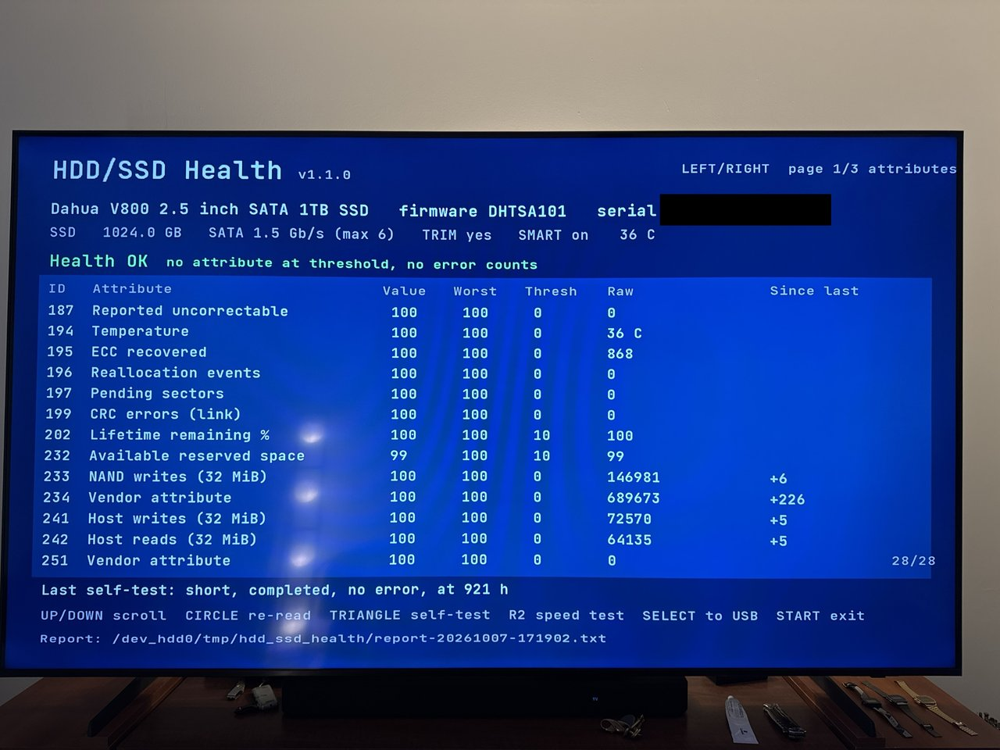
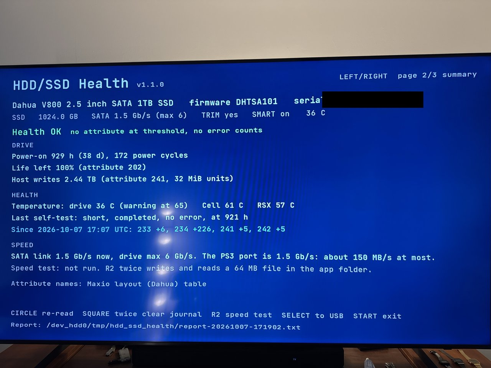
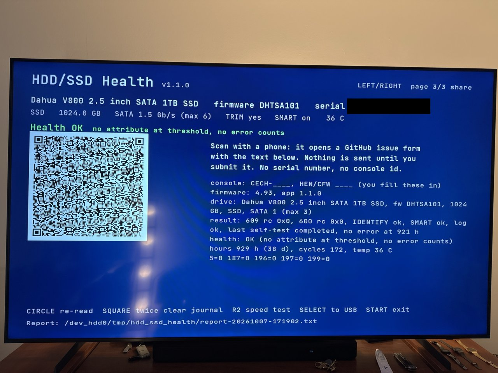
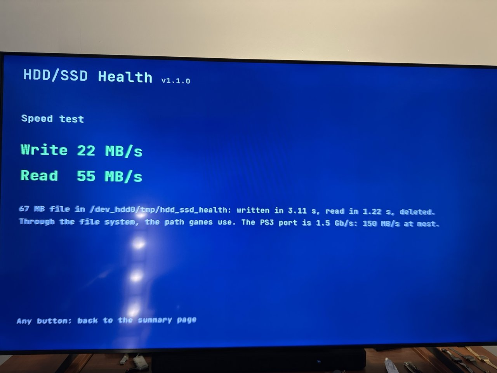

# HDD/SSD Health for PS3


A PS3 homebrew app that reads the SMART data of the console's **internal drive**,
HDD or SSD, and shows it on the TV. It also runs the drive's SMART short self-test
and a file speed test. No PC and no opening the console.

It shows, on three pages (LEFT/RIGHT):
- **Attributes:** the model, firmware, serial number, capacity and drive type (SSD,
  or HDD with its rpm); the SATA link speed, TRIM support and temperature; a
  health line (OK / WARN / FAIL) with its reason; the full SMART attribute table
  (value, worst, threshold, raw) with vendor names where the vendor documents
  them, and a column with the change since the last report.
- **Summary:** power-on time, power cycles, SSD life left and TB written where
  the vendor states the unit, the drive and console temperatures, the SATA link,
  the speed test, what changed since the last report, the last self-test.
- **Share:** a QR code. A phone scan opens a new GitHub issue with the
  compatibility report as title and body (no serial number, no console id), so
  a result reaches the "Tested on" table below without a PC.

Each run saves a text report on the console. SELECT copies it to a USB stick.

## Screenshots

Photos of the TV on the test console (1.1.0). The drive serial number is covered.

<table>
<tr>
<td><br>The icon and the background as the XMB composes them (rendered from the pkg art).</td>
<td><br>Attributes page: drive, health line, the table with the change since the last report.</td>
</tr>
<tr>
<td><br>Summary page: drive, health and speed sections.</td>
<td><br>Share page: the QR code and the text it carries.</td>
</tr>
<tr>
<td><br>The speed test result screen.</td>
<td></td>
</tr>
</table>

## Status and compatibility

The app was tested on one console: a PS3 Super Slim on **HFW 4.93 with PS3HEN
3.6.0** and a Dahua V800 1 TB SATA SSD. IDENTIFY, the SMART reads and the short
self-test all work there. The table lists the versions tested on the console.

It is **not tested** on CFW (Evilnat, Rebug and others), on fat or slim models, on
other firmware versions, or on original HDDs. On another setup, the drive command
can be refused (the app then says "not supported") or it can freeze the console
(see below). If you try it, please open an issue with your model, firmware, drive
and the result, and it goes into this table.

### Tested on

| Model | Firmware | Drive | Version | Result | Source |
|---|---|---|---|---|---|
| Super Slim (CECH-4xxx) | HFW 4.93 + PS3HEN 3.6.0 | Dahua V800 1 TB SATA SSD | 1.1.0 | IDENTIFY, SMART reads, the short self-test, the speed test (write 25, read 63 MB/s), USB copy, QR scan and demo mode work | author |
| Super Slim (CECH-4xxx) | HFW 4.93 + PS3HEN 3.6.0 | Dahua V800 1 TB SATA SSD | 1.0.1 | IDENTIFY, SMART reads and the short self-test work | author |

An issue report needs: the model line of the console, the firmware and HEN/CFW
version, the drive (from the main screen or the report), the app version, and
what happened (works, "not supported", or a freeze and at which step). The QR
code on the share page opens a new issue with all of it filled in except the
console model and the HEN/CFW version (a blank issue, not the
[issue form](../../issues/new?template=compat-report.yml): the GitHub mobile app,
which catches the link on a phone, fills only title and body). The report file
ends with the same text.

## Install

1. Download `HDD-SSD-Health-v1.1.0.pkg` from [Releases](../../releases).
2. Copy it to `/dev_hdd0/packages/` (FTP), or to the root of a FAT32 USB stick.
3. With HEN on, install it: Game → Package Manager → Install Package Files (Standard
   or USB).
4. Start **HDD/SSD Health** from the Game column, with no game running.

## Use

1. The first screen tests a file write in silence. When it works, it offers
   **CROSS** to read the drive (and SELECT for demo mode). When it fails, it says
   so in red and does not touch the drive.
2. The main screen shows the drive, the health line and the attribute table.
   LEFT/RIGHT switch to the summary page and the share page.
3. Buttons:
   - UP/DOWN scroll the table, L1/R1 by a screen.
   - CIRCLE reads the drive again. Rows whose raw value changed since the
     previous read turn blue.
   - TRIANGLE twice starts the short self-test (about 1–2 min) on its own
     screen: a progress bar, a seconds counter, then the result. Any button
     goes back to the table while the drive continues; TRIANGLE returns to the
     test screen. The result comes from the new
     entry in the drive's self-test log, not from a timer: a drive that accepts
     the command but never runs the test shows "no progress" in yellow, not a pass.
   - R2 twice runs the speed test: the app writes a 64 MB file in its folder
     in 1 MB pieces, reads it back and deletes it, and shows both rates. This
     goes through the file system, the path games use, so it is what the
     console sees, not the drive's raw speed. The result goes to the summary
     page and the report, after a result screen with the two rates. The PS3's
     SATA port is 1.5 Gb/s, so about 150 MB/s is the most any drive shows here.
   - SELECT copies the current report and `journal.txt` to the first USB stick
     found, into `hdd_ssd_health/`. In demo mode SELECT goes back to the first
     screen.
   - SQUARE twice clears the freeze journal (below). For every two-press
     gesture, any other button cancels the first press.
   - START, or Quit Game from the PS button menu, exits and closes the drive.

Files on the console, in `/dev_hdd0/tmp/hdd_ssd_health/`:
- `report-YYYYMMDD-HHMMSS.txt` — one report per read (UTC time). The serial
  number is masked (`AB******78`). The report ends with the compatibility text.
- `identify.bin`, `smart.bin`, `thresh.bin`, `selftest.bin`, `devinfo.bin` — the
  raw sectors of the last read. `identify.bin` holds the full serial number and
  the WWN: do not attach it to a public issue.
- `smart.when` — the time and the model of the last `smart.bin`. The next start
  reads both files and shows the change per attribute ("since last" column, and
  a line on the summary page). A different model gives no delta.
- `journal.txt` — the freeze journal (below).
- `demo/` — put `identify.bin`, `smart.bin` and, if you have them, `thresh.bin`
  and `selftest.bin` here, then press SELECT on the first screen: the app shows
  these sectors and never touches the drive (demo mode, "DEMO" in the title).
  Reports go to `demo-report-*.txt` and the real dumps stay. This is how a
  dump from an issue is reproduced, and how screenshots are taken.

## Safety

The app sends only these ATA commands:
- IDENTIFY DEVICE;
- SMART READ DATA, READ THRESHOLDS and READ LOG 06h (the self-test log);
- SMART EXECUTE OFF-LINE IMMEDIATE, subcommand 01h (short self-test in off-line
  mode), and only when you press TRIANGLE twice.

It never sends a write, a standby, a captive self-test or a SMART enable/disable.
The short self-test does not change data: the drive checks itself and keeps
serving normal I/O.

Besides the ATA commands, the app makes one other system call, journaled like
the drive calls: 383 `sys_game_get_temperature`, the Cell and RSX temperatures
for the summary. The speed test uses the normal file calls, the same ones that
write the report. (Raw sector reads, syscall 602, and the console id, syscall
870, are refused on HEN: ENXIO and EPERM on the test console. The app does not
call them.)

Sending ATA commands to the internal drive from a PS3 app was new ground. While
we tested, one other method (syscall 604 with LV1 command 0x22) **froze the
console**, and only a forced power-off recovered it. The release uses only the
method that worked. Because another firmware can behave differently, the app
writes each drive call to `journal.txt` (synced) before it runs it. If the
console freezes inside a call, the next start finds the call without a "done"
line and never runs that call again. Each such call runs in its own thread while
the screen shows a seconds counter: a counter that stops is a frozen console. After a forced power-off, let the console
check its file system at boot if it offers to, and never choose "Restore PS3
System".

The app reads only the last 32 KB of the journal, so a long session cannot hide
the newest entry. To try a skipped call again (for example after a firmware
change), press SQUARE twice on any screen: the journal is emptied, and the next
start runs every call again.

## SSD in a PS3: no TRIM

The PS3 firmware predates TRIM and never sends it, on any model or firmware.
The app shows "TRIM yes" only as a drive capability. Without TRIM, the SSD's own
garbage collection does all the work, and it can only reuse blocks it knows are
free: its spare area. On a full drive, write speed and wear depend on that spare
area alone.

The known mitigation is over-provisioning before the drive goes into the
console: on a PC, make the drive smaller with a Host Protected Area
(`hdparm -N p<sectors> /dev/sdX` on Linux, or the vendor's tool), leaving 10 to
20 percent unused. The PS3 formats only the visible part, and the controller
uses the rest as spare area. The app cannot set this: HPA commands are writes,
and the drive holds the running system. A read-only check whether an HPA is
set (READ NATIVE MAX ADDRESS EXT) is planned for 1.2.

The app also cannot send TRIM itself: TRIM takes a list of free sectors, and
the PS3 file system is encrypted per sector by LV1, so no app can know which
sectors are free. A wrong range destroys data.

## Health line

- **FAIL:** a normalized attribute value is at or below its threshold now.
- **WARN:** a value was at the threshold in the past (worst), a raw error count is
  not 0 (5 reallocated, 10 spin retry, 184 end-to-end, 187 uncorrectable, 196
  reallocation events, 197 pending, 198 offline uncorrectable, 199 CRC = cable or
  link), or the last self-test failed.
- **WARN** also when the drive temperature is at or above 55 C (HDD) or 65 C (SSD).
- **OK:** none of the above.

Attribute names come from a small hand-written table per vendor (Samsung,
Micron/Crucial, Kingston, WD/HGST, Seagate, SanDisk/WD SSD, Intel, Toshiba, and
the Maxio controller layout that Dahua uses), built from the vendors' public
SMART notes, not from any GPL database (`source/vendor.c`). Where the vendor is
unknown or does not document an ID, the name is the generic one, or "Vendor
attribute" with the raw value. The same table says which attribute is the SSD
life percentage and in which unit the host-writes attribute counts; without a
documented unit the summary shows the raw value and no TB figure. Some vendors
set every threshold to 0, so for them only the raw counters can raise a warning.
[docs/validation.md](docs/validation.md) compares the decoder with `smartctl`.

## How it reaches the drive

The app is a PSL1GHT app and uses these LV2 syscalls on device
`0x0101000000000007` (the internal drive):

| Step | Syscall | Note |
|---|---|---|
| size | 609 `sys_storage_get_device_info` | needs the root flag (0x40) that `make_self_npdrm` sets |
| open | 600 `sys_storage_open` | same |
| ATA commands | 616 `sys_storage_execute_device_command`, command 2 (LV1 `SEND_ATA_COMMAND`) | 32-byte ATA block, 512-byte data buffer |

The 32-byte block is the Linux kernel's `lv1_ata_cmnd_block`
(`drivers/block/ps3disk.c`) cut before its `buffer` field: `features,
sector_count, LBA_low, LBA_mid, LBA_high` (u16 each), `device, command` (u8),
`is_ext, proto, in_out, size` (u32), 4 pad bytes. That is the same cut as the BD
drive's 56-byte ATAPI block that webMAN, multiMAN and xai_plugin send: LV2 adds
its own bounce buffer.

## Build

### Requirements

- macOS on Apple Silicon or Intel, or Linux x86_64 (the ps3dev bundle exists for
  these three). The scripts are zsh.
- `curl`, `git`, `make`, `shasum` and a C compiler for the host test (`cc`).
- Python 3.11 or newer. `verify_self.py` needs `pycryptodome`; `art/` needs
  `Pillow`. `build.sh` runs the verifier as `python3 -I`, which ignores
  `~/.local` packages, so install them into a venv and point `PYTHON` at it:
  `python3 -m venv ~/.local/share/ps3dev/venv && ~/.local/share/ps3dev/venv/bin/pip install pycryptodome Pillow`,
  then `PYTHON=~/.local/share/ps3dev/venv/bin/python3 ./build.sh`.
- The key file for `verify_self.py` (step 3 below). Without it, `make pkg` still
  builds the pkg, and only the check is missing.

```zsh
./sdk_setup.sh   # once: ~/ps3dev = ps3dev bundle + PSL1GHT 2020 runtime (about 20 s)
./build.sh       # → hdd_ssd_health.gnpdrm.pkg
python3 art/make_art.py <Inter[opsz,wght].ttf>          # only to redraw ICON0/PIC1 and docs/icon.png
python3 art/make_font.py <JetBrainsMono[wght].ttf>      # only to regenerate source/font.c
```

`sdk_setup.sh` downloads the prebuilt ps3dev bundle `nightly-2026-07-26` for the
host (`ps3dev-macos-ARM64`, `ps3dev-macos-X64` or `ps3dev-linux-X64`, SHA-256
checked) with `curl` if `~/ps3dev` is missing. Then it builds PSL1GHT `6e565a7`
(2020-11-25, `ppu/` only), tiny3D and libfont3d into it.
`build.sh`:
1. runs the host unit test (`test/test_smart.c`: the decoders, the vendor table,
   the summary, the delta, the issue link and a QR encode) on the Mac;
2. runs `make pkg`;
3. runs `python3 -I verify_self.py`, which decrypts the signed EBOOT, compares
   every segment with the ELF and recomputes each segment's HMAC-SHA1 and the
   ECDSA signature. The Sony key material it needs is not in this repository:
   the script reads it from `~/.local/share/ps3dev/keys.toml` (or `$PS3DEV_KEYS`),
   seven hex strings named `KEYPAIR_E`, `ERK`, `RIV`, `SIG_R`, `SIG_N`, `SIG_K`,
   `SIG_DA`, copied from PSL1GHT's `tools/geohot` (`keys.h`, `oddkeys.h`). See
   [NOTICE](NOTICE), item 6.

Toolchain findings that cost the most time:
- **Apps built with PSL1GHT's 2021+ runtime do not start on HFW 4.93 + PS3HEN
  3.6.0.** They show a black screen and return to the XMB after about 10 s,
  before `main`. A `main()` that only sleeps 60 s came back after 10 s, and the
  same file linked with the 2020 runtime slept the full 60 s. Rebuilding the
  GamePad Test sample with the 2026 bundle failed the same way, while its older
  build runs. The likely suspects are the heap rewrite (`d2ea732`) and the
  pre-`main` `strdup` added for chdir/getcwd (`99dd0b9`); neither is tested alone.
  This is why `sdk_setup.sh` exists.
- Link `-lfont3d`, not `-lfont`: tiny3D renamed its font library in 2020, and
  `-lfont` now finds PSL1GHT's cellFont stub.
- `sysFs*` (libsysfs) are stubs for the cellFs module, which an app must load
  first. The app uses the `sysLv2Fs*` syscalls from `sys/file.h`.
- The macOS ARM64 `make_self` (CEX self) can crash with a bus error under make.
  The CEX self is not used, so the Makefile skips it.

### CI and releases

GitHub Actions (`.github/workflows/ci.yml`) runs on every push: the host test of
the decoder, a compile and `--help` smoke of the Python scripts, and a pkg build
on Linux with the same `sdk_setup.sh` (the pkg is a workflow artifact). The
signed EBOOT is verified in CI only when the repository secret `PS3DEV_KEYS_TOML`
holds the key file. A `v*` tag (`.github/workflows/release.yml`) builds the pkg
and attaches `HDD-SSD-Health-<tag>.pkg` and `SHA256SUMS` to a draft release.

## Credits

- [PSL1GHT](https://github.com/ps3dev/PSL1GHT) and the
  [ps3dev](https://github.com/ps3dev/ps3dev) toolchain (MIT).
- [tiny3D](https://github.com/wargio/tiny3D) and libfont3d by Hermes, under the
  PSL1GHT license.
- [GamePad Test](https://github.com/ErikPshat/GamePad-Test) by Zar, the model for
  the tiny3d UI.
- The Linux kernel's `ps3disk.c` for the LV1 ATA block, and RPCS3 for the LV2
  syscall table.
- The QR code is made by Project Nayuki's
  [QR Code generator library](https://www.nayuki.io/page/qr-code-generator-library) (MIT).
- The on-screen font is a bitmap of [JetBrains Mono](https://github.com/JetBrains/JetBrainsMono)
  (SIL Open Font License), made by `art/make_font.py`.
- The icon and background are drawn by `art/make_art.py`; their text uses the
  [Inter](https://github.com/rsms/inter) font (SIL Open Font License).

## License

MIT, see [LICENSE](LICENSE). Third-party code and data in the pkg: [NOTICE](NOTICE).
