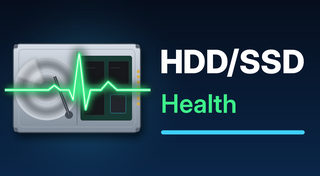
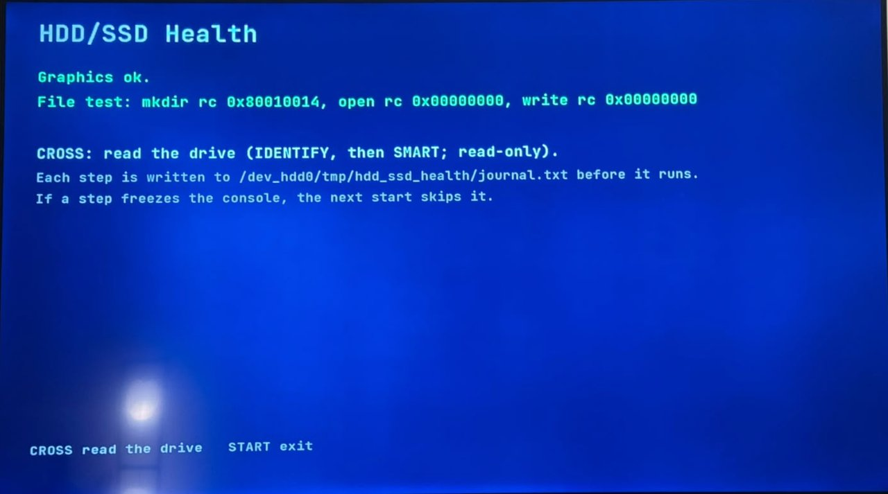
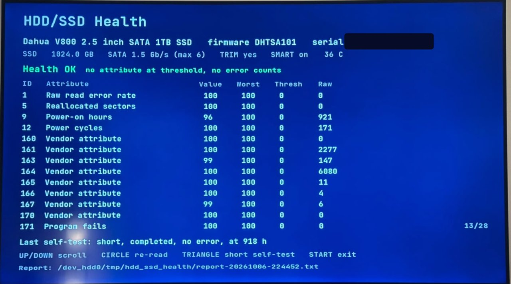
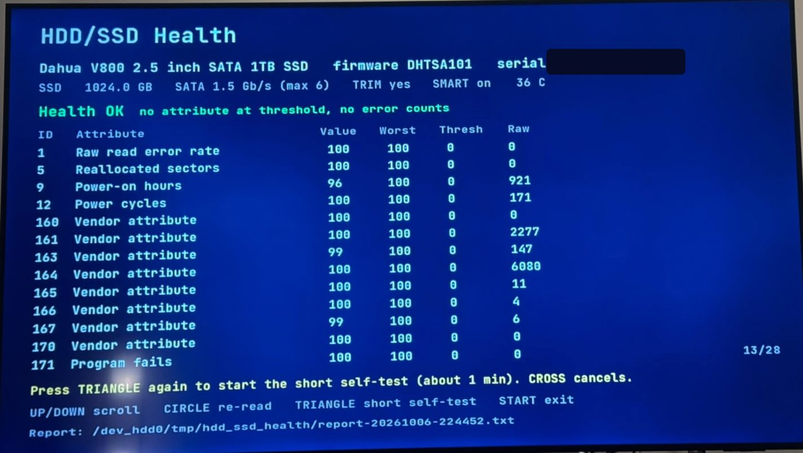
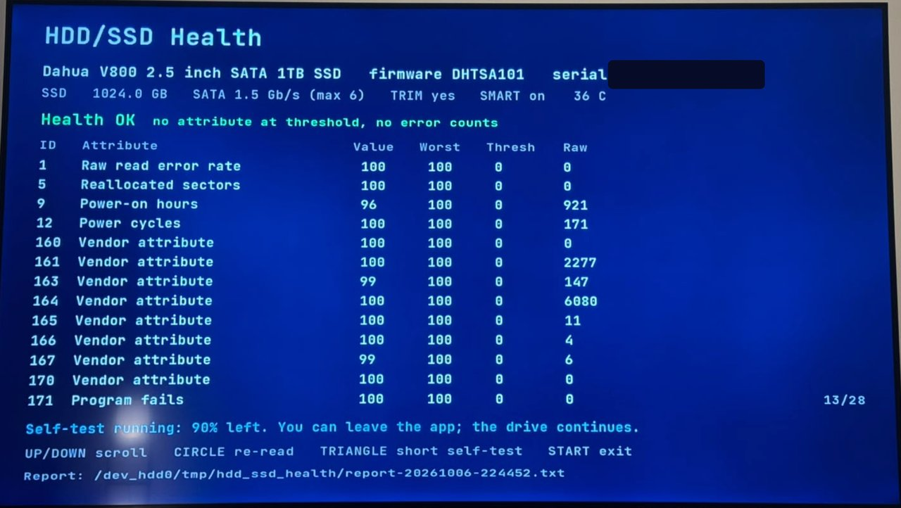
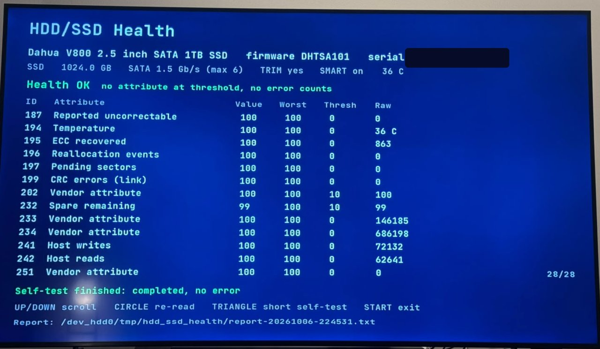

# HDD/SSD Health for PS3



A PS3 homebrew app that reads the SMART data of the console's **internal drive**,
HDD or SSD, and shows it on the TV. It also runs the drive's SMART short self-test.
No PC and no opening the console.

It shows:
- the model, firmware, serial number, capacity and drive type (SSD, or HDD with its rpm);
- the SATA link speed, TRIM support and temperature;
- a health line (OK / WARN / FAIL) with its reason;
- the full SMART attribute table (value, worst, threshold, raw);
- the self-test log, and a button that starts the short self-test.

Each run saves a text report on the console.

## Screenshots

Photos of the TV on the test console. The drive serial number is hidden.

<table>
<tr>
<td><br>The XMB icon and background.</td>
<td><br>First screen: the graphics and file test.</td>
</tr>
<tr>
<td><br>Main screen: drive, health line, attributes, last self-test.</td>
<td><br>TRIANGLE once: the app asks for a second press.</td>
</tr>
<tr>
<td><br>The self-test runs. The line shows the progress.</td>
<td><br>The self-test finished. The table is at its end (28/28).</td>
</tr>
</table>

## Status and compatibility

Version 1.0.1 works on one console: a PS3 Super Slim on **HFW 4.93 with PS3HEN
3.6.0** and a Dahua V800 1 TB SATA SSD. IDENTIFY, the SMART reads and the short
self-test all work there.

It is **not tested** on CFW (Evilnat, Rebug and others), on fat or slim models, on
other firmware versions, or on original HDDs. On another setup, the drive command
can be refused (the app then says "not supported") or it can freeze the console
(see below). If you try it, please open an issue with your model, firmware, drive
and the result, and it goes into this table.

### Tested on

| Model | Firmware | Drive | Version | Result | Source |
|---|---|---|---|---|---|
| Super Slim (CECH-4xxx) | HFW 4.93 + PS3HEN 3.6.0 | Dahua V800 1 TB SATA SSD | 1.0.1 | IDENTIFY, SMART reads and the short self-test work | author |

An issue report needs: the model line of the console, the firmware and HEN/CFW
version, the drive (from the main screen or the report), the app version, and
what happened (works, "not supported", or a freeze and at which step).

## Install

1. Download `HDD-SSD-Health-v1.0.1.pkg` from [Releases](../../releases).
2. Copy it to `/dev_hdd0/packages/` (FTP), or to the root of a FAT32 USB stick.
3. With HEN on, install it: Game → Package Manager → Install Package Files (Standard
   or USB).
4. Start **HDD/SSD Health** from the Game column, with no game running.

## Use

1. The first screen tests the graphics and a file write. When both lines are green,
   press **CROSS** to read the drive.
2. The main screen shows the drive, the health line and the attribute table.
3. Buttons:
   - UP/DOWN scroll, L1/R1 page.
   - CIRCLE reads the drive again.
   - TRIANGLE twice starts the short self-test (about 1–2 min). The line at the
     bottom shows the progress, then the result. The result comes from the new
     entry in the drive's self-test log, not from a timer: a drive that accepts
     the command but never runs the test shows "no progress" in yellow, not a pass.
   - SQUARE twice clears the freeze journal (below). Any other button cancels the
     first press.
   - START, or Quit Game from the PS button menu, exits and closes the drive.

Files on the console, in `/dev_hdd0/tmp/hdd_ssd_health/`:
- `report-YYYYMMDD-HHMMSS.txt` — one report per read (UTC time). The serial
  number is masked (`AB******78`).
- `identify.bin`, `smart.bin`, `thresh.bin`, `selftest.bin`, `devinfo.bin` — the
  raw sectors of the last read. `identify.bin` holds the full serial number and
  the WWN: do not attach it to a public issue.
- `journal.txt` — the freeze journal (below).

## Safety

The app sends only these ATA commands:
- IDENTIFY DEVICE;
- SMART READ DATA, READ THRESHOLDS and READ LOG 06h (the self-test log);
- SMART EXECUTE OFF-LINE IMMEDIATE, subcommand 01h (short self-test in off-line
  mode), and only when you press TRIANGLE twice.

It never sends a write, a standby, a captive self-test or a SMART enable/disable.
The short self-test does not change data: the drive checks itself and keeps
serving normal I/O.

Sending ATA commands to the internal drive from a PS3 app was new ground. While
we tested, one other method (syscall 604 with LV1 command 0x22) **froze the
console**, and only a forced power-off recovered it. The release uses only the
method that worked. Because another firmware can behave differently, the app
writes each drive call to `journal.txt` (synced) before it runs it. If the
console freezes inside a call, the next start finds the call without a "done"
line and never runs that call again. After a forced power-off, let the console
check its file system at boot if it offers to, and never choose "Restore PS3
System".

The app reads only the last 32 KB of the journal, so a long session cannot hide
the newest entry. To try a skipped call again (for example after a firmware
change), press SQUARE twice on any screen: the journal is emptied, and the next
start runs every call again.

## Health line

- **FAIL:** a normalized attribute value is at or below its threshold now.
- **WARN:** a value was at the threshold in the past (worst), a raw error count is
  not 0 (5 reallocated, 10 spin retry, 184 end-to-end, 187 uncorrectable, 196
  reallocation events, 197 pending, 198 offline uncorrectable, 199 CRC = cable or
  link), or the last self-test failed.
- **OK:** none of the above.

Attribute names appear only where the meaning is the same across vendors. Other
IDs show as "Vendor attribute", with the raw value. Some vendors set every
threshold to 0, so for them only the raw counters can raise a warning.

## How it reaches the drive

The app is a PSL1GHT app and uses these LV2 syscalls on device
`0x0101000000000007` (the internal drive):

| Step | Syscall | Note |
|---|---|---|
| size | 609 `sys_storage_get_device_info` | needs the root flag (0x40) that `make_self_npdrm` sets |
| open | 600 `sys_storage_open` | same |
| ATA commands | 616 `sys_storage_execute_device_command`, command 2 (LV1 `SEND_ATA_COMMAND`) | 32-byte ATA block, 512-byte data buffer |

The 32-byte block is the Linux kernel's `lv1_ata_cmnd_block`
(`drivers/block/ps3disk.c`) cut before its `buffer` field: `features,
sector_count, LBA_low, LBA_mid, LBA_high` (u16 each), `device, command` (u8),
`is_ext, proto, in_out, size` (u32), 4 pad bytes. That is the same cut as the BD
drive's 56-byte ATAPI block that webMAN, multiMAN and xai_plugin send: LV2 adds
its own bounce buffer.

## Build (macOS on Apple Silicon)

```zsh
./sdk_setup.sh   # once: ~/ps3dev = ps3dev bundle + PSL1GHT 2020 runtime (about 20 s)
./build.sh       # → hdd_ssd_health.gnpdrm.pkg
python3 art/make_art.py <Inter[opsz,wght].ttf>          # only to redraw ICON0/PIC1
python3 art/make_font.py <JetBrainsMono[wght].ttf>      # only to regenerate source/font.c
```

`sdk_setup.sh` downloads the prebuilt ps3dev bundle `nightly-2026-07-26`
(`ps3dev-macos-ARM64.tar.gz`, checksum checked) if `~/ps3dev` is missing. Then it
builds PSL1GHT `6e565a7` (2020-11-25, `ppu/` only), tiny3D and libfont3d into it.
`build.sh`:
1. runs the decoder unit test (`test/test_smart.c`) on the Mac;
2. runs `make pkg`;
3. runs `python3 -I verify_self.py`, which decrypts the signed EBOOT, compares
   every segment with the ELF and recomputes each segment's HMAC-SHA1 and the
   ECDSA signature. The Sony key material it needs is not in this repository:
   the script reads it from `~/.local/share/ps3dev/keys.toml` (or `$PS3DEV_KEYS`),
   seven hex strings named `KEYPAIR_E`, `ERK`, `RIV`, `SIG_R`, `SIG_N`, `SIG_K`,
   `SIG_DA`, copied from PSL1GHT's `tools/geohot` (`keys.h`, `oddkeys.h`). See
   [NOTICE](NOTICE), item 6.

Toolchain findings that cost the most time:
- **Apps built with PSL1GHT's 2021+ runtime do not start on HFW 4.93 + PS3HEN
  3.6.0.** They show a black screen and return to the XMB after about 10 s,
  before `main`. A `main()` that only sleeps 60 s came back after 10 s, and the
  same file linked with the 2020 runtime slept the full 60 s. Rebuilding the
  GamePad Test sample with the 2026 bundle failed the same way, while its older
  build runs. The likely suspects are the heap rewrite (`d2ea732`) and the
  pre-`main` `strdup` added for chdir/getcwd (`99dd0b9`); neither is tested alone.
  This is why `sdk_setup.sh` exists.
- Link `-lfont3d`, not `-lfont`: tiny3D renamed its font library in 2020, and
  `-lfont` now finds PSL1GHT's cellFont stub.
- `sysFs*` (libsysfs) are stubs for the cellFs module, which an app must load
  first. The app uses the `sysLv2Fs*` syscalls from `sys/file.h`.
- The macOS ARM64 `make_self` (CEX self) can crash with a bus error under make.
  The CEX self is not used, so the Makefile skips it.

## Credits

- [PSL1GHT](https://github.com/ps3dev/PSL1GHT) and the
  [ps3dev](https://github.com/ps3dev/ps3dev) toolchain (MIT).
- [tiny3D](https://github.com/wargio/tiny3D) and libfont3d by Hermes, under the
  PSL1GHT license.
- [GamePad Test](https://github.com/ErikPshat/GamePad-Test) by Zar, the model for
  the tiny3d UI.
- The Linux kernel's `ps3disk.c` for the LV1 ATA block, and RPCS3 for the LV2
  syscall table.
- The on-screen font is a bitmap of [JetBrains Mono](https://github.com/JetBrains/JetBrainsMono)
  (SIL Open Font License), made by `art/make_font.py`.
- The icon and background are drawn by `art/make_art.py`; their text uses the
  [Inter](https://github.com/rsms/inter) font (SIL Open Font License).

## License

MIT, see [LICENSE](LICENSE). Third-party code and data in the pkg: [NOTICE](NOTICE).
