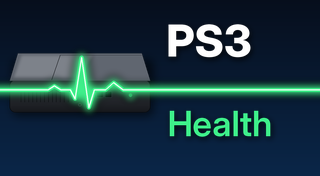
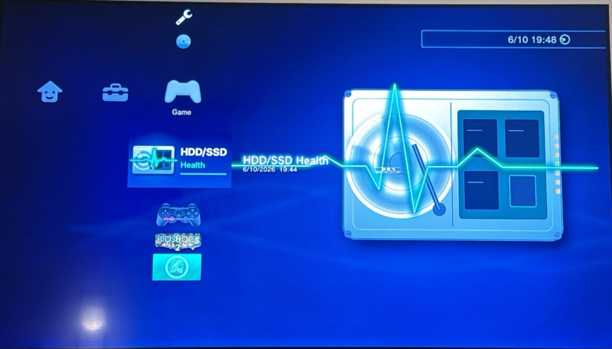
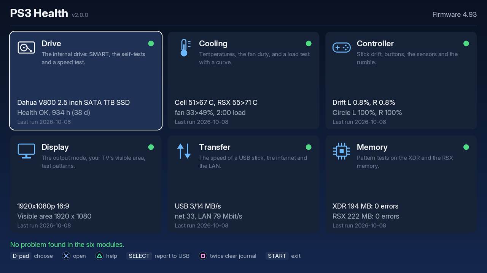
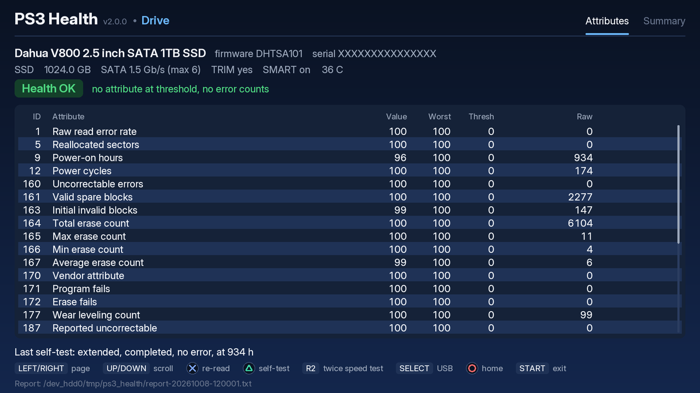
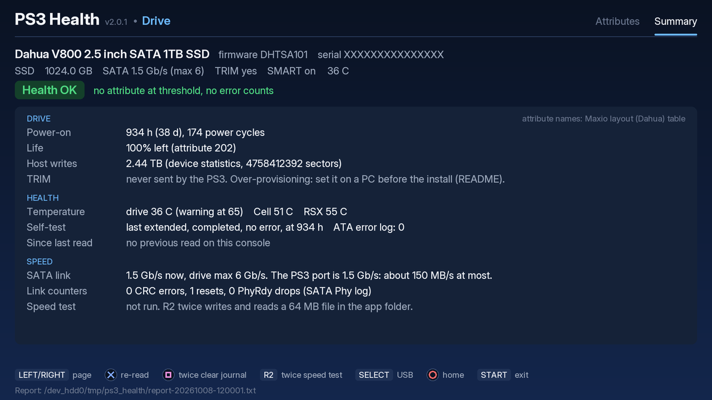
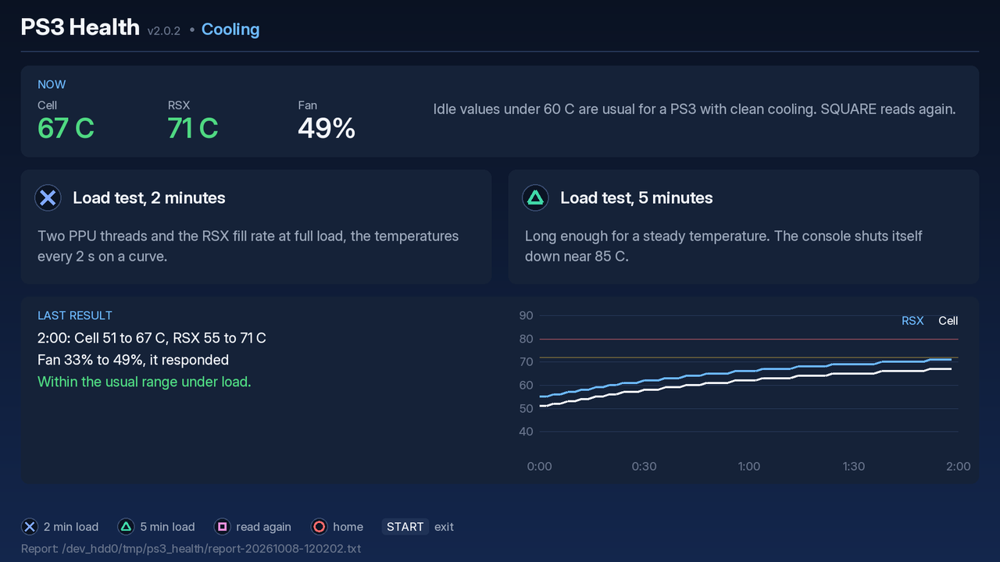
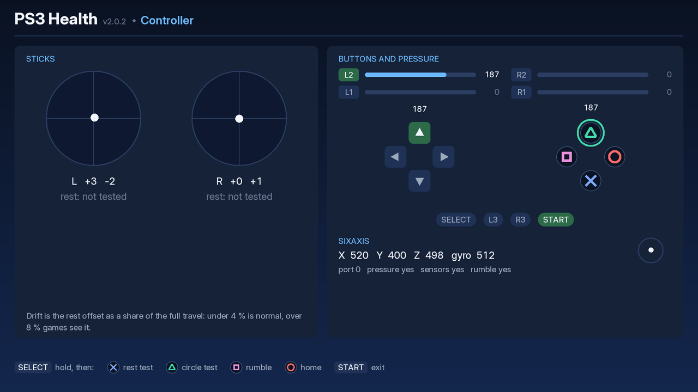
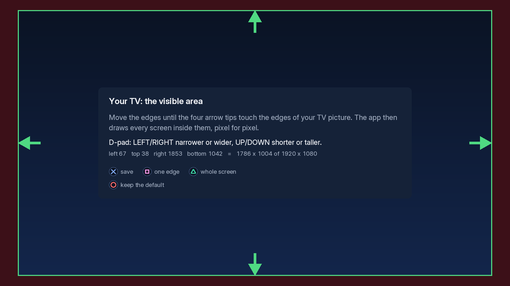
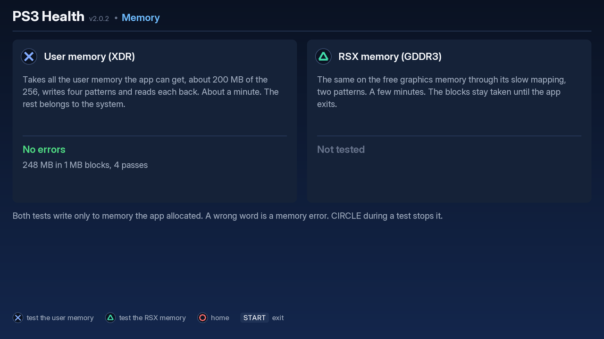
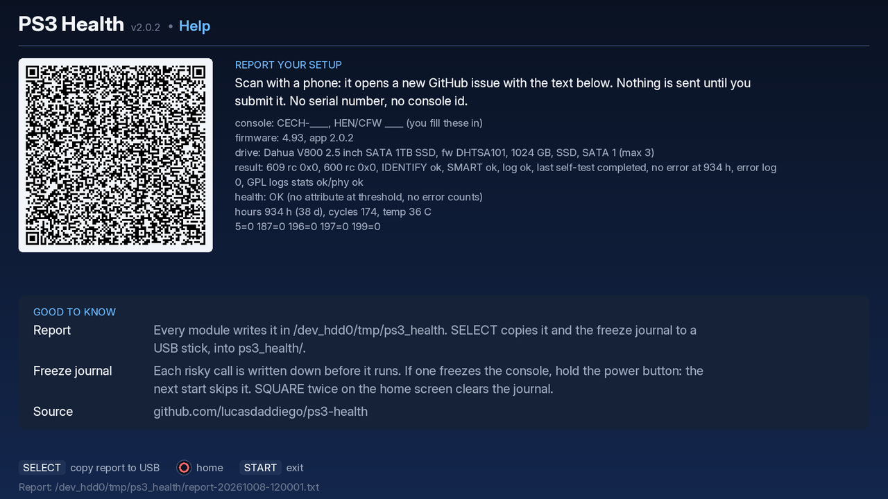

# PS3 Health



A PS3 homebrew app that checks the console's hardware from the TV, with no PC
and no opening the console. Six modules behind one home screen:

- **Drive:** IDENTIFY and SMART of the internal HDD or SSD, the attribute table
  with vendor names, a health line, the short and the extended self-test, and a
  file speed test.
- **Cooling:** the Cell and RSX temperatures, the fan duty, and a timed load
  test with a temperature curve.
- **Controller:** stick rest offset (drift) and circle coverage, every button
  with its pressure, the sixaxis sensors, the rumble motors.
- **Display:** the video output, the visible area of your TV, full-screen
  test patterns (with a 1-pixel stripe test for TV scaling) and a lag timer.
- **Transfer:** the 64 MB file test on a USB stick, a 50 MB download over plain
  HTTP, and a LAN test where the app is the server and a PC sends it data.
- **Memory:** pattern tests on the user memory (XDR) and on the RSX memory
  (GDDR3).

Help (TRIANGLE on the home screen) has a QR code that opens a prefilled GitHub
issue with the compatibility report, and a short guide.

The home screen shows the last result of each module from a small state file
and sends no command to the hardware. Every result goes into one text report on
the console; SELECT copies it and the freeze journal to a USB stick.

The app draws at **1920 x 1080**, pixel for pixel at 1080p output: the text is
Inter, rendered at the exact size it is shown, and every screen sits inside
the visible area of your TV, which you set once at the first start. At 720p
the console scales the picture down and the text stays readable. At 480p or
576p the text is small: the layouts are made for HD.

Until 1.3.0 the app was "HDD/SSD Health", the Drive module alone.

## Screenshots

The screens are rendered on a Mac from the app's own code at 1920 x 1080. The
drive data comes from the author's SSD with the serial number masked. The
temperatures, the sticks and the memory size are simulated.

<table>
<tr>
<td><br>The icon and the background as the XMB composes them (rendered from the pkg art).</td>
<td><br>The home screen: what each module checks, and its last result.</td>
</tr>
<tr>
<td><br>Drive, attributes page: the SMART table with the vendor's attribute names.</td>
<td><br>Drive, summary page.</td>
</tr>
<tr>
<td><br>Cooling: a 2-minute load test and its temperature curve.</td>
<td><br>Controller: the sticks, every button with its pressure, the sensors.</td>
</tr>
<tr>
<td><br>The visible area of your TV, asked at the first start.</td>
<td><br>Memory: the user memory test passed.</td>
</tr>
<tr>
<td><br>Help: the QR code that opens a prefilled GitHub issue, and a short guide.</td>
<td></td>
</tr>
</table>

## Status and compatibility

The app was tested on one console: a PS3 Super Slim on **HFW 4.93 with PS3HEN
3.6.0** and a Dahua V800 1 TB SATA SSD. The table lists the versions tested on
the console.

It is **not tested** on CFW (Evilnat, Rebug and others), on fat or slim models, on
other firmware versions, or on original HDDs. On another setup, a drive command
can be refused (the app then says "not supported") or it can freeze the console
(see Safety). If you try it, please open an issue with your model, firmware,
drive and the result, and it goes into this table.

### Tested on

| Model | Firmware | Drive | Version | Result | Source |
|---|---|---|---|---|---|
| Super Slim (CECH-4xxx) | HFW 4.93 + PS3HEN 3.6.0 | Dahua V800 1 TB SATA SSD | 2.0.2 | the first build on the ps3gfx library, at 1080p: the drive reads, the speed test (24/62 MB/s) and the start of the extended self-test, the temperatures and the fan duty under the 2-minute load (Cell 56>57 C, RSX 52>58 C, fan 25 %), the display and the visible area, internet (32 Mbit/s) and LAN (82 Mbit/s), the memory tests (XDR 194 MB, RSX 231 MB, no errors), Help, Quit Game; the journal and the status page followed over FTP and HTTP by ps3run for the whole run (12 min in game, no freeze); USB and the controller not run | author |
| Super Slim (CECH-4xxx) | HFW 4.93 + PS3HEN 3.6.0 | Dahua V800 1 TB SATA SSD | 2.0.1 | the six modules at 1080p with the app's own renderer: the drive reads, the speed test (24/61 MB/s) and a short self-test, the temperatures and the fan duty under load, the controller, the display and the visible area, internet (33 Mbit/s) and LAN (77 Mbit/s), the memory tests (XDR 194 MB, RSX 231 MB, no errors), Help with the QR code, Quit Game and a new start; USB not run (no stick) | author |
| Super Slim (CECH-4xxx) | HFW 4.93 + PS3HEN 3.6.0 | Dahua V800 1 TB SATA SSD | 2.0.0 | the six modules at 1080p: the drive reads and the speed test, the temperatures and the fan duty, the controller (drift 0.8 %, circle 100 %), the display and the visible area, USB (3/14 MB/s), internet (33 Mbit/s) and LAN (79 Mbit/s), the memory tests (XDR 194 MB, RSX 222 MB, no errors), Help with the QR code | author |
| Super Slim (CECH-4xxx) | HFW 4.93 + PS3HEN 3.6.0 | Dahua V800 1 TB SATA SSD | 1.3.0 | all of 1.2.0, plus the extended self-test (three runs, about 2 min each on this SSD, all passed) and the pickup of a test that is still running at the next start | author |
| Super Slim (CECH-4xxx) | HFW 4.93 + PS3HEN 3.6.0 | Dahua V800 1 TB SATA SSD | 1.2.0 | all of 1.1.0, plus the error log and the two general purpose logs (device statistics, Phy counters) | author |
| Super Slim (CECH-4xxx) | HFW 4.93 + PS3HEN 3.6.0 | Dahua V800 1 TB SATA SSD | 1.1.0 | IDENTIFY, SMART reads, the short self-test, the speed test (write 25, read 63 MB/s), USB copy, QR scan and demo mode work | author |
| Super Slim (CECH-4xxx) | HFW 4.93 + PS3HEN 3.6.0 | Dahua V800 1 TB SATA SSD | 1.0.1 | IDENTIFY, SMART reads and the short self-test work | author |

An issue report needs: the model line of the console, the firmware and HEN/CFW
version, the drive (from the Drive module or the report), the app version, and
what happened (works, "not supported", or a freeze and at which step). The QR
code on the Help screen (TRIANGLE on the home screen) opens a new issue with
all of it filled in except the console model and the HEN/CFW version (a blank
issue, not the
[issue form](../../issues/new?template=compat-report.yml): the GitHub mobile app,
which catches the link on a phone, fills only title and body). The report file
ends with the same text.

## Install

1. Download `PS3-Health-v2.0.2.pkg` from [Releases](../../releases).
2. Copy it to `/dev_hdd0/packages/` (FTP), or to the root of a FAT32 USB stick.
3. With HEN on, install it: Game → Package Manager → Install Package Files (Standard
   or USB).
4. Start **PS3 Health** from the Game column, with no game running.

## Use

At the first start the app asks for the visible area of your TV: move the
edges until the four arrow tips touch the edges of the picture (D-pad: both
sides together; SQUARE: one edge at a time), then CROSS. CIRCLE keeps the
default, 93 % of the screen. The Display module can change it later.

The home screen: six tiles, each with what the module checks, a dot (green ok,
yellow check, red problem, hollow when the module never ran), two lines from
the last result and its date, and a verdict line under them. D-pad chooses,
CROSS opens a module, CIRCLE in a module goes back home, START exits. TRIANGLE
opens Help: the QR code of the compatibility report (it opens a prefilled
GitHub issue on a phone; nothing is sent until you submit it) and a short
guide. SELECT copies the report and `journal.txt` to the first USB stick found,
into `ps3_health/`. SQUARE twice clears the freeze journal (see Safety). The
button line at the bottom of each screen shows the controller's own symbols.

### Drive

1. The first screen offers **CROSS** to read the drive and TRIANGLE for demo
   mode. The app writes each step to the journal before it runs it.
2. Two pages (LEFT/RIGHT): the attribute table and a summary.
   - UP/DOWN scroll the table, L1/R1 by a screen.
   - CROSS reads the drive again. Rows whose raw value changed since the
     previous read turn blue.
   - TRIANGLE offers a self-test: CROSS for the short one (about 1–2 min),
     TRIANGLE for the extended one (the whole surface; the drive states the
     minutes, often 60 or more). It runs on its own screen: a progress bar, a
     seconds counter, then the result. Any other button goes back to the table
     while the drive continues; TRIANGLE returns to the test screen. START and
     CIRCLE are blocked while a test runs: the drive is busy with the test, and
     the console becomes very slow until it ends (seen on a PS3 Super Slim
     during the extended test). Quit Game from the PS button still exits; the
     next start then finds the test running and shows its progress, then the
     result. Neither test can be aborted from the app. The result comes from
     the new entry in the drive's self-test log, not from a timer: a drive that
     accepts the command but never runs the test shows "no progress" in
     yellow, not a pass.
   - R2 twice runs the speed test: a 64 MB file written in 1 MB pieces in the
     app folder, read back and deleted, both rates shown. This goes through
     the file system, the path games use. The PS3's SATA port is 1.5 Gb/s, so
     about 150 MB/s is the most any drive shows here.
3. Demo mode shows the sectors saved in `demo/` and never touches the drive
   ("DEMO" in the title). Reports go to `demo-report-*.txt`.

### Cooling

The Cell and RSX temperatures (syscall 383) and the fan duty (syscall 409,
`sys_sm_get_fan_policy`, the read half of what webMAN uses; behind a first-run
prompt; the module stays closed when the app cannot write its journal). CROSS
runs a 2-minute load test, TRIANGLE a 5-minute one: two PPU
threads at full load and the RSX drawing 160 full-screen layers per frame,
the temperatures every 2 s on a curve, then the peak values and the fan
response. CIRCLE stops the test early and keeps the curve.

The verdict compares the peak with the usual range seen on a PS3 with clean
cooling: under 72 C ok, 72 to 79 C "warm, clean it", 80 C and above "hotter
than usual". The console protects itself and shuts down near 85 C. The app
never writes to the fan.

### Controller

Live view of both sticks, every button with its pressure value, L2/R2 bars,
the sixaxis values with a level bubble. Every button only lights up here, so
START and CIRCLE can be tested too; the actions need SELECT held. SELECT +
CROSS runs the rest test: three seconds without touching the sticks give the
mean offset from the centre (drift, as a percentage of full travel: under 4 %
is normal, over 8 % games see it) and the noise. SELECT + TRIANGLE runs the
circle test: turn both sticks around their full edge for 8 s, and the app
shows how much of the circle each stick reached. SELECT + SQUARE runs the
small motor, then the large one. SELECT + CIRCLE goes home, SELECT + START
exits.

### Display

The output mode (resolution, scan, aspect, color space, refresh). CROSS
adjusts the visible area, as at the first start (L1/R1 choose the edge in the
one-edge mode, TRIANGLE takes the whole screen). TRIANGLE shows the test
patterns: white, black, red, green, blue (dead and stuck pixels), a 16-step
gray ramp, a crosshatch with a circle for geometry and aspect, 1-pixel stripes
(at 1080p, even stripes mean the TV shows every pixel; moire bands mean it
scales the picture, overscan on), and a lag pattern with a millisecond timer
and a moving bar to film next to the source; CROSS there flashes one white
frame.

### Transfer

CROSS: the 64 MB file test on the first USB stick found. TRIANGLE: a 50 MB
download over plain HTTP from `speed.cloudflare.com` (another `http://` URL
goes in `net_url.txt` in the app folder; no https). SQUARE: the app listens
on TCP port 5201 for two minutes and shows its address and the command for
the PC (`nc <address> 5201 < /dev/zero`); it receives for 10 s and shows the
rate. A download counts only when the whole file arrived. The wired port is
1 Gbit/s on every PS3, Wi-Fi is 802.11g.

### Memory

CROSS takes all the user memory (XDR) the app can get in 1 MB blocks, about
200 MB of the 256, writes four patterns (address based, its inverse,
alternating bits, a linear congruential sequence) and reads each back. A wrong
word is an error, listed with its address. TRIANGLE does the same on the free RSX
memory (GDDR3) through its mapping, two patterns; it is slow by design, and
the blocks stay taken until the app exits (the RSX allocator gives nothing
back). Both write only to memory the app allocated. CIRCLE stops a test.

### Files on the console

In `/dev_hdd0/tmp/ps3_health/`:
- `report-YYYYMMDD-HHMMSS.txt` — one report per write (UTC time): the console
  line, then a section per module with a result. The drive serial number is
  masked (`AB******78`). The drive section ends with the compatibility text.
- `state.txt` — the last result of each module, for the home screen.
- `compat.txt` — the compatibility text of the last Drive result. Help shows
  it until the Drive module runs in the session.
- `safe_area.txt` — the visible area, in 1920 x 1080 units.
- `net_url.txt` — optional, the `http://` URL for the download test.
- `identify.bin`, `smart.bin`, `thresh.bin`, `selftest.bin`, `errlog.bin`,
  `devstat.bin`, `phy.bin`, `devinfo.bin` — the raw sectors of the last drive
  read. `identify.bin` holds the full serial number and the WWN: do not attach
  it to a public issue.
- `smart.when` — the time and the model of the last `smart.bin`, for the
  "since last" column. A different model gives no delta.
- `journal.txt` — the freeze journal (below).
- `gfx_init.txt` — written only when the app cannot start its picture: the
  number of the renderer's init step that failed (`gfx_be_init` in ps3gfx's
  `source/gfx/gfx_rsx.c`). The app then goes back to the XMB.
- `demo/` — put `identify.bin`, `smart.bin` and, if you have them, `thresh.bin`
  and `selftest.bin` here for demo mode. This is how a dump from an issue is
  reproduced, and how the Drive screenshots are taken.

## Safety

The Drive module sends only these ATA commands:
- IDENTIFY DEVICE;
- SMART READ DATA, READ THRESHOLDS and READ LOG 06h (the self-test log);
- SMART EXECUTE OFF-LINE IMMEDIATE, subcommand 01h (short self-test) or 02h
  (extended self-test), both in off-line mode, and only after TRIANGLE and
  your choice on the self-test screen;
- behind a first-run prompt (the app shows what the command does and asks for
  CROSS before it runs the first time; CIRCLE skips it, and the skip is kept
  until SQUARE twice clears the journal): SMART READ LOG 01h, the summary error
  log; and READ LOG EXT 2Fh on a drive with General Purpose Logging, the device
  statistics log (04h, pages 1, 5 and 7) and the SATA Phy event counters log
  (11h). Up to five 512-byte reads.

A note on what the path cannot do: the system call returns the data buffer
and a status word, not the drive's registers. A non-data command whose answer
is in the registers, like READ NATIVE MAX ADDRESS EXT, comes back empty (tested
on the author's console: accepted, no registers). So the app cannot tell
whether a Host Protected Area is set.

It never sends a write, a standby, a captive self-test or a SMART enable/disable.
The self-tests do not change data: the drive checks itself and keeps serving
normal I/O. The extended one reads the whole surface, so it takes long and
slows the drive while it runs.

The other system calls, all read-only and journaled like the drive calls:
383 `sys_game_get_temperature` (Cell and RSX) and, behind a first-run prompt,
409 `sys_sm_get_fan_policy` (the fan duty). The speed and USB tests use the
normal file calls, the Transfer module the normal socket calls, the Memory
module its own allocations, the Display module the video state read. (Raw
sector reads, syscall 602, and the console id, syscall 870, are refused on
HEN: ENXIO and EPERM on the test console. The app does not call them.) The
build checks this: `tools/syscalls.py` scans the ELF for every syscall number
and fails on 602, 604 or 870, or on a number outside `tools/syscalls.allow`.

Sending ATA commands to the internal drive from a PS3 app was new ground. While
we tested, one other method (syscall 604 with LV1 command 0x22) **froze the
console**, and only a forced power-off recovered it. The release uses only the
method that worked. Because another firmware can behave differently, the app
writes each journaled call to `journal.txt` (synced) before it runs it. If the
console freezes inside a call, the next start finds the call without a "done"
line and never runs that call again. Each such call runs in its own thread while
the screen shows a seconds counter: a counter that stops is a frozen console.
After a forced power-off, let the console check its file system at boot if it
offers to, and never choose "Restore PS3 System".

The app reads only the last 32 KB of the journal, so a long session cannot hide
the newest entry. A `skip` line records a command you declined at its first-run
prompt. To try a skipped or frozen call again (for example after a firmware
change), press SQUARE twice on the home screen: the journal is emptied, and the
next start asks or runs every call again.

## SSD in a PS3: no TRIM

The PS3 firmware predates TRIM and never sends it, on any model or firmware.
The app shows "TRIM yes" only as a drive capability. Without TRIM, the SSD's own
garbage collection does all the work, and it can only reuse blocks it knows are
free: its spare area. On a full drive, write speed and wear depend on that spare
area alone.

The known mitigation is over-provisioning before the drive goes into the
console: on a PC, make the drive smaller with a Host Protected Area
(`hdparm -N p<sectors> /dev/sdX` on Linux, or the vendor's tool), leaving 10 to
20 percent unused. The PS3 formats only the visible part, and the controller
uses the rest as spare area. The app cannot set this: HPA commands are writes,
and the drive holds the running system. It cannot see it either: the native
size comes back in the drive's registers, which the PS3's system call does not
return (see Safety).

The app also cannot send TRIM itself: TRIM takes a list of free sectors, and
the PS3 file system is encrypted per sector by LV1, so no app can know which
sectors are free. A wrong range destroys data.

## Drive health line

- **FAIL:** a normalized attribute value is at or below its threshold now.
- **WARN:** a value was at the threshold in the past (worst), a raw error count is
  not 0 (5 reallocated, 10 spin retry, 184 end-to-end, 187 uncorrectable, 196
  reallocation events, 197 pending, 198 offline uncorrectable, 199 CRC = cable or
  link), or the last self-test failed.
- **WARN** also when the drive temperature is at or above 55 C (HDD) or 65 C (SSD).
- **OK:** none of the above.

Attribute names come from a small hand-written table per vendor (Samsung,
Micron/Crucial, Kingston, WD/HGST, Seagate, SanDisk/WD SSD, Intel, Toshiba, and
the Maxio controller layout that Dahua uses), built from the vendors' public
SMART notes, not from any GPL database (`source/vendor.c`). Where the vendor is
unknown or does not document an ID, the name is the generic one, or "Vendor
attribute" with the raw value. The same table says which attribute is the SSD
life percentage and in which unit the host-writes attribute counts; without a
documented unit the summary shows the raw value and no TB figure. Some vendors
set every threshold to 0, so for them only the raw counters can raise a warning.
[docs/validation.md](docs/validation.md) compares the decoder with `smartctl`.

## How it reaches the drive

The app is a PSL1GHT app and uses these LV2 syscalls on device
`0x0101000000000007` (the internal drive):

| Step | Syscall | Note |
|---|---|---|
| size | 609 `sys_storage_get_device_info` | needs the root flag (0x40) that `make_self_npdrm` sets |
| open | 600 `sys_storage_open` | same |
| ATA commands | 616 `sys_storage_execute_device_command`, command 2 (LV1 `SEND_ATA_COMMAND`) | 32-byte ATA block, 512-byte data buffer |

The 32-byte block is the Linux kernel's `lv1_ata_cmnd_block`
(`drivers/block/ps3disk.c`) cut before its `buffer` field: `features,
sector_count, LBA_low, LBA_mid, LBA_high` (u16 each), `device, command` (u8),
`is_ext, proto, in_out, size` (u32), 4 pad bytes. That is the same cut as the BD
drive's 56-byte ATAPI block that webMAN, multiMAN and xai_plugin send: LV2 adds
its own bounce buffer.

## Code layout

The frame the app draws in is [ps3gfx](https://github.com/lucasdaddiego/ps3gfx),
PS3 Health 2.0.1's own code moved into a library: the renderer (about 500
lines that write the RSX command words themselves, no librsx), the text (Inter
atlases, one quad per glyph, pixel exact at 1080p, tabular digits for tables
and counters), the drawing kit, the pad, the blocking call in a second thread
with a counter, the first-run prompt, the visible-area screen, the freeze
journal and the file helpers. The app links `libps3gfx.a` and includes
`<ps3gfx/ui.h>`, `<ps3gfx/gfx.h>`, `<ps3gfx/journal.h>` and `<ps3gfx/fs.h>`;
the library's README has the API by header, and its `source/gfx/README.md` the
frame model, the memory layout, the source of each RSX word and the recipe for
the shader words. What stays here: `main.c` and `app.h` (the modules behind
the `module` struct), `home.c` (the home screen and `state.txt`), `help.c`
(the Help screen with the QR code), `report.c` (the report and the USB copy),
one `mod_*.c` per module, `ata.c` and `smart.c` (the drive access and the
decoders), the vendor table, the compatibility text and the QR encoder.

## Build

### Requirements

- macOS on Apple Silicon or Intel, or Linux x86_64 (the ps3dev bundle exists for
  these three). The scripts are zsh.
- `curl`, `git`, `make`, `shasum` and a C compiler for the host test (`cc`).
- Python 3.11 or newer. `verify_self.py` needs `pycryptodome`; `art/` needs
  `Pillow`. `build.sh` runs the verifier as `python3 -I`, which ignores
  `~/.local` packages, so install them into a venv and point `PYTHON` at it:
  `python3 -m venv ~/.local/share/ps3dev/venv && ~/.local/share/ps3dev/venv/bin/pip install pycryptodome Pillow`,
  then `PYTHON=~/.local/share/ps3dev/venv/bin/python3 ./build.sh`.
- The key file for `verify_self.py` (step 3 below). Without it, `make pkg` still
  builds the pkg, and only the check is missing.

```zsh
./sdk_setup.sh   # once: ~/ps3dev = ps3dev bundle + PSL1GHT 2020 runtime + ps3gfx at its pin (about 20 s)
./build.sh       # → ps3_health.gnpdrm.pkg
python3 art/make_art.py <Inter[opsz,wght].ttf>          # only to redraw ICON0/PIC1 and docs/icon.png
```

With `PS3DEV_ARCHIVE=<folder>` the script reads everything from that folder
instead of the internet (`bundles/<the bundle file>`, `src/PSL1GHT.bundle` and
`src/ps3gfx.bundle` as git bundles) and checks the same checksum and pins: an
offline build from a kept copy of the sources.
`sdk_setup.sh` downloads the prebuilt ps3dev bundle `nightly-2026-07-26` for the
host (`ps3dev-macos-ARM64`, `ps3dev-macos-X64` or `ps3dev-linux-X64`, SHA-256
checked) with `curl` if `~/ps3dev` is missing. Then it builds PSL1GHT `6e565a7`
(2020-11-25, `ppu/` only) into it, pinned to its full commit hash. Then it
clones ps3gfx into `~/ps3dev/src/ps3gfx` at the commit `PS3GFX_REV` pins (the
full id, in the script) and runs its `make install`, which puts `libps3gfx.a`,
the `<ps3gfx/*.h>` headers, `OFL.txt` and a `COMMIT` stamp into the bundle's
`portlibs/ppu`: the only thing the app uses from there. One `~/ps3dev` serves
every app on the library and the last install wins, so `build.sh` first checks
that the archive is there and that its `COMMIT` equals the pin (`PS3GFX_DEV=1`
skips the stamp check, for a build against a working clone installed by hand).
Then `build.sh`:
1. runs the host unit test (`test/test_smart.c`: the decoders, the vendor table,
   the summary, the delta, the issue link and a QR encode) on the Mac;
2. runs `make pkg`;
3. runs `python3 -I tools/syscalls.py build/ps3_health.elf`: it lists the LV2
   syscall numbers the ELF makes (each `li r11, N` before an `sc`) and fails
   when one is not in `tools/syscalls.allow`, or when 602, 604 or 870 appears
   (see Safety). A number that reaches r11 another way escapes the scan, so
   this is a guard against a mistake, not a proof. `--write` rewrites the
   allowlist from a known-good ELF, and `--allow <file>` takes another
   allowlist (another app that runs these checks);
4. runs `python3 -I verify_self.py`, which decrypts the signed EBOOT, compares
   every segment with the ELF and recomputes each segment's HMAC-SHA1 and the
   ECDSA signature. The Sony key material it needs is not in this repository:
   the script reads it from `~/.local/share/ps3dev/keys.toml` (or `$PS3DEV_KEYS`),
   seven hex strings named `KEYPAIR_E`, `ERK`, `RIV`, `SIG_R`, `SIG_N`, `SIG_K`,
   `SIG_DA`, copied from PSL1GHT's `tools/geohot` (`keys.h`, `oddkeys.h`). See
   [NOTICE](NOTICE), item 5.

`tools/preview/build.zsh` hands the app to ps3gfx's preview (the clone in
`~/ps3dev/src/ps3gfx`, or `$PS3GFX`), which compiles it for the Mac against
stub headers and renders its screens to PNG; `tools/preview/pv_app.c` is the
app's part of that world, a drive emulated from a console's sector dumps: a
check of layouts and text without a TV. It also makes the screenshots above
(see its README).

Toolchain findings that cost the most time:
- **Apps built with PSL1GHT's 2021+ runtime do not start on HFW 4.93 + PS3HEN
  3.6.0.** They show a black screen and return to the XMB after about 10 s,
  before `main`. A `main()` that only sleeps 60 s came back after 10 s, and the
  same file linked with the 2020 runtime slept the full 60 s. Rebuilding the
  GamePad Test sample with the 2026 bundle failed the same way, while its older
  build runs. The likely suspects are the heap rewrite (`d2ea732`) and the
  pre-`main` `strdup` added for chdir/getcwd (`99dd0b9`); neither is tested alone.
  This is why `sdk_setup.sh` exists.
- `sysFs*` (libsysfs) are stubs for the cellFs module, which an app must load
  first. The app uses the `sysLv2Fs*` syscalls from `sys/file.h`.
- The macOS ARM64 `make_self` (CEX self) can crash with a bus error under make.
  The CEX self is not used, so the Makefile skips it.

### CI and releases

GitHub Actions (`.github/workflows/ci.yml`) runs on every push: the host test of
the decoder, a compile and `--help` smoke of the Python scripts with the
`syscalls.py` self-test, and a pkg build on Linux with the same `sdk_setup.sh`
(the pkg is a workflow artifact) followed by the syscall audit of its ELF. The
signed EBOOT is verified in CI only when the repository secret `PS3DEV_KEYS_TOML`
holds the key file. A `v*` tag (`.github/workflows/release.yml`) builds the pkg
and attaches `PS3-Health-<tag>.pkg` and `SHA256SUMS` to a draft release.

## Credits

- [PSL1GHT](https://github.com/ps3dev/PSL1GHT) and the
  [ps3dev](https://github.com/ps3dev/ps3dev) toolchain (MIT).
- [GamePad Test](https://github.com/ErikPshat/GamePad-Test) by Zar, the model for
  the first UI.
- The Linux kernel's `ps3disk.c` for the LV1 ATA block, and RPCS3 for the LV2
  syscall table and for how libgcm and the RSX read the renderer's words.
- The QR code is made by Project Nayuki's
  [QR Code generator library](https://www.nayuki.io/page/qr-code-generator-library) (MIT).
- [ps3gfx](https://github.com/lucasdaddiego/ps3gfx) (MIT): the renderer, the
  text and the app frame, PS3 Health 2.0.1's own code as a library.
- The on-screen text (through ps3gfx) and the icon's words use [Inter](https://github.com/rsms/inter)
  (SIL Open Font License): bitmap atlases made by ps3gfx's `art/make_font.py`,
  and the icon and background drawn by `art/make_art.py`.

## License

MIT, see [LICENSE](LICENSE). Third-party code and data in the pkg: [NOTICE](NOTICE).
